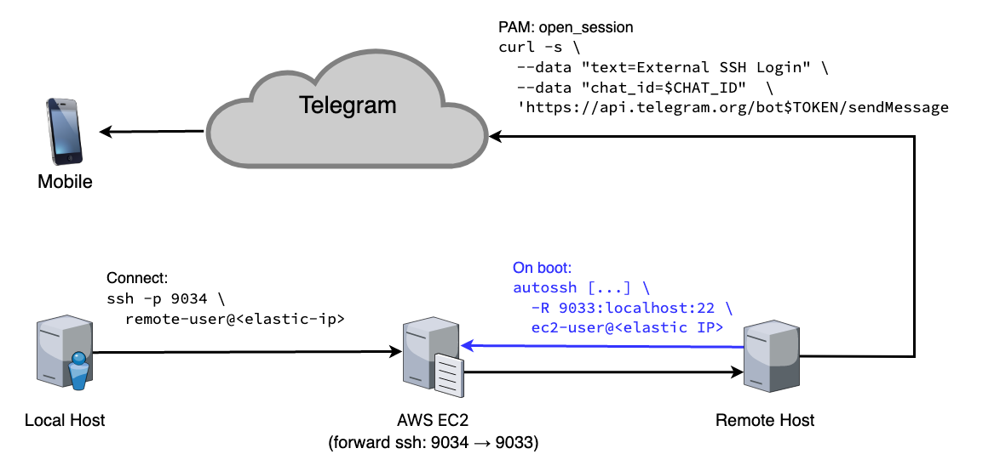

# ez-ssh-bot

SSH Reverse Tunnel with Login Notifications via Telegram Bot



## Create a Telegram bot

Contact [@BotFather](https://t.me/botfather) on Telegram and type `/start`. Then follow instructions to create a bot and get an access token. The token will look like this: `4098346289:YUI_OLIJi98y78078yyhi7ovghjoTGniuss`. It grants full control over your bot, so keep it private.

Now create a new Telegram channel and add your bot as a member, so it can send messages to the channel. Now post a "test" message from your own account and navigate to this page to find the channel ID:
[https://api.telegram.org/bot&lt;bot-access-token&gt;/getUpdates](https://api.telegram.org/bot4098346289:YUI_OLIJi98y78078yyhi7ovghjoTGniuss/getUpdates) and then find the channel ID in field `result/message/chat/id` of the returned JSON:

```json
{
  "ok": true,
  "result": [
    {
      "update_id": 108063316,
      "message": {
        "message_id": 1,
        "from": {
          "id": <channel ID>,
          "is_bot": false,
          "first_name": "Stefan",
          "username": "weliveindetail",
          "language_code": "en"
        },
        "chat": {
          "id": <channel ID>,
          "first_name": "Stefan",
          "username": "weliveindetail",
          "type": "private"
        },
        "date": 1667396395,
        "text": "test"
      }
    }
  ]
}
```

Enter both, your bot-token and channel ID in the `ez-ssh-bot.sh` script in this repo. Then test your bot with the script:
```shell
> export PAM_TYPE=open_session
> export PAM_RHOST=127.0.0.1
> ./ez-ssh-bot.sh
```

You should receive a "External SSH Login" message in your Telegram channel now. Once that works, copy the script to `/etc/ssh` and restrict access:
```shell
> sudo cp ez-ssh-bot.sh /etc/ssh/.
> sudo chown root /etc/ssh/ez-ssh-bot.sh
> sudo chmod 100 /etc/ssh/ez-ssh-bot.sh
```

## Set up a free AWS EC2 Instance

This article will guide you through the configuration step by step &mdash; remember your elastic IP address and where you saved the `.pem` file from your key pair: https://www.opensourceforu.com/2021/09/how-to-do-reverse-tunnelling-with-the-amazon-ec2-instance/

## Create a dedicated user for AutoSSH

Create the user, set a password, copy over the `.pem` file for your EC2 instance and make sure the `known_hosts` file exists:
```shell
> sudo useradd -m ez-ssh-bot
> sudo passwd ez-ssh-bot
> sudo mkdir -p /home/ez-ssh-bot/.ssh
> sudo cp /path/to/private/ec2-key.pem /home/ez-ssh-bot/.ssh/ez-ssh-bot.pem
> sudo chown ez-ssh-bot /home/ez-ssh-bot/.ssh/ez-ssh-bot.pem
> sudo chmod 600 /home/ez-ssh-bot/.ssh/ez-ssh-bot.pem
> sudo touch /home/ez-ssh-bot/.ssh/known_hosts
> sudo chown ez-ssh-bot /home/ez-ssh-bot/.ssh/known_hosts
```

Switch to the new user once in order to test the SSH connection and confirm the server fingerprint. Here you will need the elastic IP address of your EC2 instance:
```shell
> su - ez-ssh-bot
Password: ...
ez-ssh-bot> ssh -i ~/.ssh/ez-ssh-bot.pem ec2-user@<elastic IP>
The authenticity of host '<elastic IP> (<elastic IP>)' can't be established.
ECDSA key fingerprint is SHA256:VhApmMgDG00DVRlwAeFqmN3hDgtJZpvuvIV9Dy39gyk.
Are you sure you want to continue connecting (yes/no/[fingerprint])? yes
[ec2-user@ip-172-31-43-51 ~]$ exit
ez-ssh-bot> wc --chars /home/ez-ssh-bot/.ssh/known_hosts
221 /home/ez-ssh-bot/.ssh/known_hosts
ez-ssh-bot> exit
```

Eventually, we can give the user a false shell to prevent further logins:
```shell
> sudo usermod -s /usr/sbin/nologin ez-ssh-bot
> su - ez-ssh-bot
Password: ...
This account is currently not available.
```

## Create a Systemd service for AutoSSH

We will run AutoSSH in Systemd, which takes care of starting it after boot and restarting it in case of failures. Enter your elastic IP in the `ez-ssh-bot.service` in this repo and copy it to the Systemd services folder:
```shell
> sudo cp ez-ssh-bot.service /etc/systemd/system/.
```

You might have to install packages like `autossh`. Then reload all units from disk, start the service and check its status:
```shell
> sudo apt install autossh
> sudo systemctl daemon-reload
> sudo systemctl start ez-ssh-bot
> systemctl status ez-ssh-bot
● ez-ssh-bot.service - SSH Reverse Tunnel with Login Notifications
     Loaded: loaded (/etc/systemd/system/ez-ssh-bot.service; disabled; vendor preset: enabled)
     Active: active (running) since Wed 2022-11-02 13:23:42 CET; 13min ago
    Process: 2337703 ExecStart=/usr/bin/autossh -M 0 -N -f -q -o ExitOnForwardFailure=yes -o ServerAliveInterval=30 -o ServerAliveCountMax=3 -i ~/.ssh/ez-ssh-bot.pem -R 9033:localhost:22 ec2-user@<elastic IP>
   Main PID: 2337706 (autossh)
      Tasks: 2 (limit: 38185)
     Memory: 1.0M
     CGroup: /system.slice/ez-ssh-bot.service
             ├─2337706 /usr/lib/autossh/autossh -M 0 -N    -q -o ExitOnForwardFailure=yes -o ServerAliveInterval=30 -o ServerAliveCountMax=3 -i ~/.ssh/ez-ssh-bot.pem -R 9033:localhost:22 ec2-user@<elastic IP>
             └─2337707 /usr/bin/ssh -N -q -o ExitOnForwardFailure=yes -o ServerAliveInterval=30 -o ServerAliveCountMax=3 -i ~/.ssh/ez-ssh-bot.pem -R 9033:localhost:22 ec2-user@<elastic IP>

Nov 02 13:23:42 i7ubuntu systemd[1]: Starting SSH Reverse Tunnel with Login Notifications...
Nov 02 13:23:42 i7ubuntu autossh[2337703]: port set to 0, monitoring disabled
Nov 02 13:23:42 i7ubuntu autossh[2337706]: starting ssh (count 1)
Nov 02 13:23:42 i7ubuntu systemd[1]: Started SSH Reverse Tunnel with Login Notifications.
Nov 02 13:23:42 i7ubuntu autossh[2337706]: ssh child pid is 2337707
```

You should now be able to ssh into your local user account through your EC2 instance:
```shell
> ssh -i /path/to/private/ec2-key.pem -p 9033 user@<elastic IP>
```

Once that works, let Systemd start the AutoSSH service automatically at boot-time:
```shell
> sudo systemctl enable ez-ssh-bot
```

## Add a PAM step to send the notification

Just add an entry for the `ez-ssh-bot.sh` script after `@include common-session` in `/etc/pam.d/sshd`:
```shell
> grep ez-ssh-bot /etc/pam.d/sshd
# Send a login notification to Telegram via ez-ssh-bot
session required pam_exec.so seteuid /etc/ssh/ez-ssh-bot.sh
```

## Voilà!


